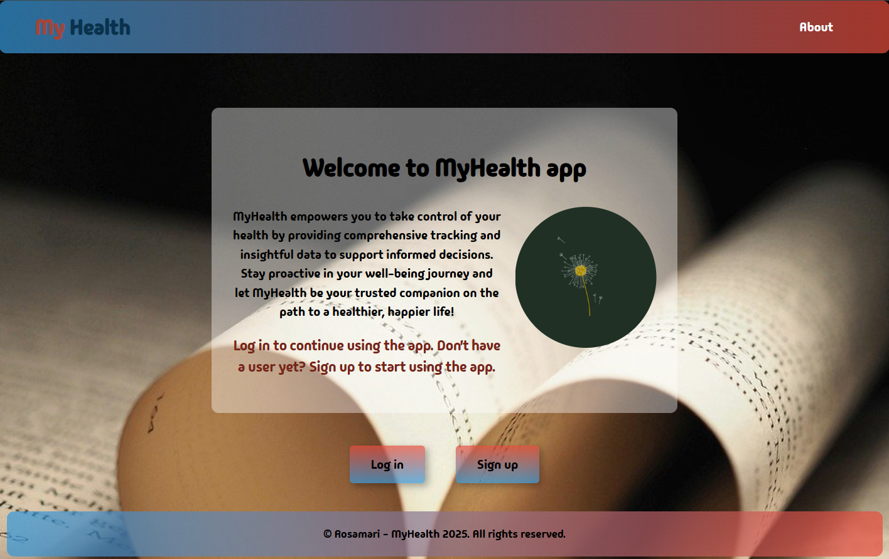
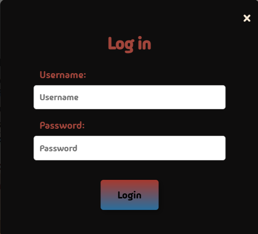
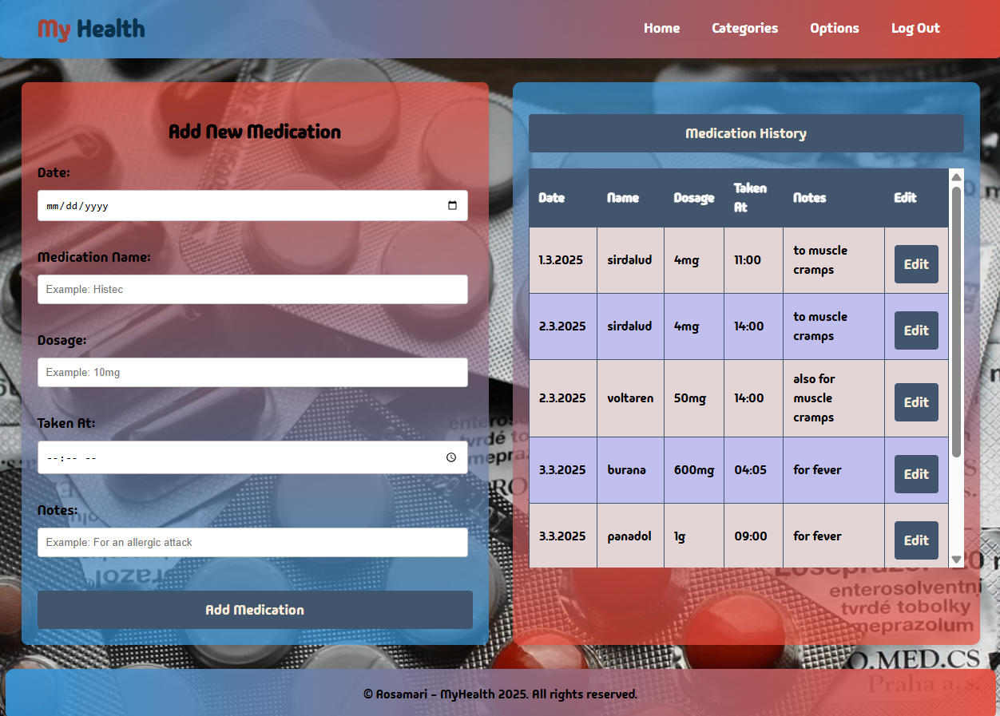
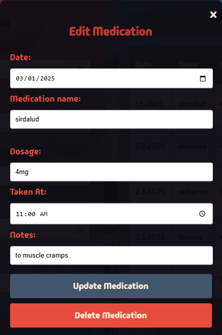
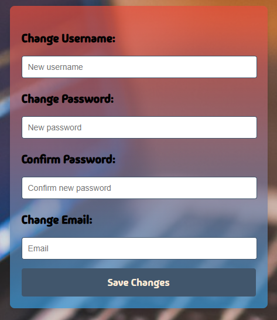

# MyHealth

MyHealth is a health information management application that allows users to monitor and manage their health data through an easy-to-use interface.

## Table of Contents
- [Overview](#overview)
- [Project Structure](#project-structure)
- [Technologies Used](#technologies-used)
- [Installation](#installation)
- [Database](#database)
- [API Documentation](#api-documentation)
- [Screenshots](#screenshots)
- [Contributors](#contributors)
- [License](#license)

## Overview

This repository contains the back-end server for the MyHealth application. The front-end client can be found in a separate repository: [MyHealth_fe](https://github.com/Rosahaut/MyHealth_fe).

## Project Structure

- **Backend:** Node.js + Express server with MySQL/MariaDB database.
- **Frontend:** React.js application with Tailwind CSS.

## Technologies Used

### Backend
- Node.js
- Express.js
- MySQL / MariaDB
- JWT Authentication
- Docker (optional)

### Frontend
- React.js
- Vite
- Tailwind CSS
- Redux Toolkit (optional)

## Installation

### Backend Installation
1. Clone the repository:
   ```sh
   git clone https://github.com/Rosahaut/MyHealth_be.git
   cd MyHealth_be
   ```
2. Install dependencies:
   ```sh
   npm install
   ```
3. Install & start MySQL/MariaDB server.
4. Import the database script from `db/health-diary.sql`.
5. Create a `.env` file based on `.env.sample`.
6. Start the development server:
   ```sh
   npm run dev
   ```

### Frontend Installation
1. Clone the frontend repository:
   ```sh
   git clone https://github.com/Rosahaut/MyHealth_fe.git
   cd MyHealth_fe
   ```
2. Install dependencies:
   ```sh
   npm install
   ```
3. Start the development server:
   ```sh
   npm run dev
   ```

## Database
The database scripts can be found in the file `db/health-diary.sql`.

## API Documentation

### User Endpoints
#### Get all users (Admin required)
```http
GET /api/users
Authorization: Bearer <ADMIN_TOKEN>
```

#### Get user by ID (Admin required)
```http
GET /api/users/{id}
Authorization: Bearer <ADMIN_TOKEN>
```

#### User Registration
```http
POST /api/users
Content-Type: application/json
```
```json
{
  "username": "example_user",
  "password": "securepassword",
  "email": "user@example.com"
}
```

#### Modify user (Admin or self)
```http
PUT /api/users/{id}
Authorization: Bearer <USER_OR_ADMIN_TOKEN>
Content-Type: application/json
```

#### Delete user (Admin required)
```http
DELETE /api/users/{id}
Authorization: Bearer <ADMIN_TOKEN>
```

#### User Login
```http
POST /api/auth/login
Content-Type: application/json
```

#### Get user info (Requires authentication)
```http
GET /api/auth/me
Authorization: Bearer <USER_TOKEN>
```

### Diary Entries
- **Create, Read, Update, Delete (CRUD) functionalities available.**

### Measurements, Exercises, and Medications
- **CRUD functionalities for managing user health data.**

For full API documentation, refer to the project documentation or Postman collection.

## Screenshots

### Index Page & Login Form
 

### Home Page


### Medication Management
 

### Settings Page


## License
This project is licensed under the MIT License.


